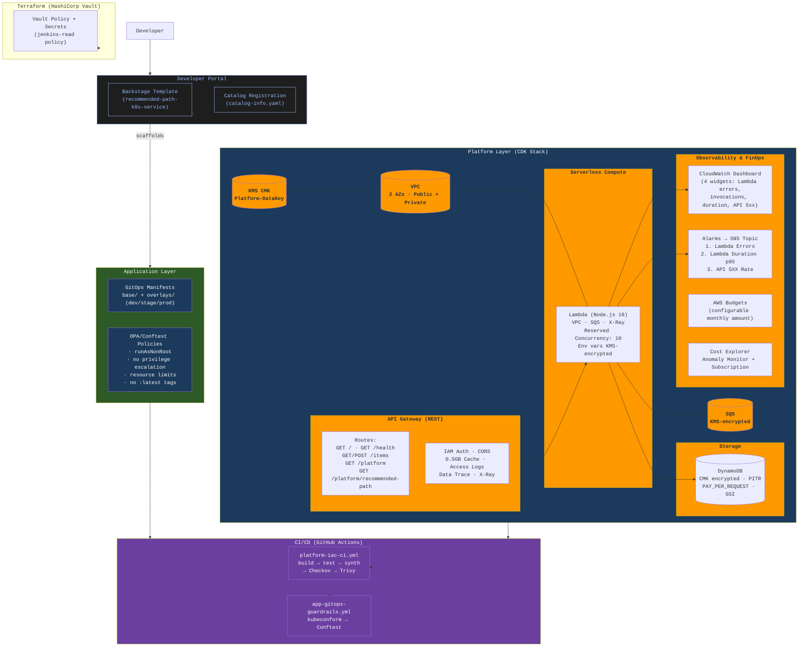

# Platform as a Product Blueprint — AWS CDK + Platform Engineering

[](https://github.com/your-org/infra-as-code-with-cdk/actions/workflows/platform-iac-ci.yml)

A production-hardened **Internal Developer Platform (IDP)** reference implementation built with **AWS CDK (TypeScript)**. This repository demonstrates modern **Platform Engineering** practices: infrastructure-as-code, GitOps, policy-as-code, observability, FinOps, and self-service developer workflows — all wired together with enterprise-grade security defaults.

---

## What This Project Demonstrates

| Skill Area | What's Implemented |
|---|---|
| **AWS CDK (TypeScript)** | Complex infrastructure as code with KMS, VPC, Lambda, API Gateway, DynamoDB, CloudWatch, SNS, SQS, WAF, Budgets & Cost Explorer |
| **Platform Engineering** | Clear separation of platform vs. application layers, Backstage scaffolder templates, product-oriented operating model |
| **GitOps & CD** | Argo CD-ready manifests, env overlays (dev/stage/prod), kubeconform validation in CI |
| **Policy-as-Code** | OPA/Conftest rules enforcing `runAsNonRoot`, `no-privilege-escalation`, resource limits, immutable image tags |
| **CI/CD Security** | Dual GitHub Actions pipelines with Checkov (CloudFormation/Terraform/GHA) and Trivy (IaC misconfig) scanning |
| **Observability** | CloudWatch dashboard (golden signals), structured JSON logging with correlation IDs, X-Ray tracing, SNS alarm fan-out (Lambda errors, p95 latency, API 5XX) |
| **FinOps** | AWS Budgets (configurable monthly), Cost Explorer anomaly detection with daily email subscriptions, `finops-managed` resource tagging |
| **Secure-by-Default** | CMK encryption on all data services, VPC-isolated Lambda, IAM auth on API Gateway, encrypted log groups (2yr retention), ALB-WAF enforcement guardrail (CDK Aspect validation) |
| **Developer Experience** | Makefile DX targets, Backstage self-service templates, typed environment config with fail-fast validation |

- A target platform architecture with:
  - Amazon EKS for workload runtime
  - GitOps with Argo CD
  - Backstage as the developer portal
  - Secure-by-default guardrails and policy checks
- Repository structure for multi-team and multi-environment operation
- Backstage software template example for self-service service creation
- CI pipeline for platform IaC quality gates (build/test/synth + Checkov + Trivy security scans)
- GitOps-oriented app delivery guardrails
- OPA/Conftest policy bundle for Kubernetes deployment security checks
- Day-2 DX helpers via `Makefile`

## Architecture



---

## Repository Structure

```
.
├── platform/                          # Platform team-owned infrastructure
│   ├── modules/                       # Reusable building blocks (network, EKS, observability)
│   ├── services/                      # Platform services (Argo CD, Backstage, monitoring)
│   └── environments/                  # Per-environment composition (dev/stage/prod)
├── applications/                      # Developer/App team owned
│   ├── gitops/                        # Kubernetes manifests + Kustomize overlays
│   │   ├── base/                      #  Reference: Namespace, Deployment, Service
│   │   └── overlays/ (dev/stage/prod)
│   ├── policy/                        # OPA/Conftest policy bundle
│   │   └── deployment-security.rego   #  Enforces security context, resource limits
│   └── templates/                     # Golden-path app templates
├── backstage/                         # Developer portal integration
│   └── templates/recommended-path-service/
│       ├── template.yaml              #  Backstage scaffolder v1beta3
│       └── scaffold/                  # Scaffold files (CI, observability, policy)
├── templates/service-catalog/         # Additional Backstage template (multi-language)
├── lib/                               # CDK application source
│   ├── cdk-app-stack.ts               #  Main stack — all AWS resources
│   ├── function.ts                    #  Lambda handler (Node.js 18)
│   ├── platform-config.ts             #  Typed env config with validation
│   └── security-guardrails.ts         #  ALB-WAF CDK Aspect validation
├── bin/app.ts                         # CDK app entry point
├── terraform/                         # HashiCorp Vault provisioning
│   ├── main.tf / providers.tf / variables.tf
│   └── versions.tf                    #  Terraform >= 1.6, Vault provider ~> 4.0
├── test/                              # Jest test suite
│   ├── cdk-app-stack.test.ts          #  Resource count + governance tag tests
│   ├── stack.test.ts                  #  FinOps + security guardrail tests
│   └── function.test.ts               #  Lambda handler unit tests
├── .github/workflows/
│   ├── platform-iac-ci.yml            #  Build → Test → Synth → Checkov → Trivy
│   └── app-gitops-guardrails.yml      #  kubeconform + Conftest on PRs
├── docs/                              # Comprehensive documentation
│   ├── platform-product-architecture.md
│   ├── platform-product-operating-model.md
│   ├── platform-engineering-consulting-profile.md
│   ├── observability-as-a-service.md
│   └── oaas-implementation-flow.md
├── catalog-info.yaml                  # Backstage entity registration
├── Makefile                           # DX: platform-check, app-deploy, policy-test, etc.
├── cdk.json / jest.config.js / tsconfig.json
└── package.json                       # CDK 2.99.1, TypeScript, esbuild, ts-jest
```

---

## Key Technical Highlights

### Platform Product Contract (API)

The deployed API exposes the platform's value proposition directly:

| Endpoint | Purpose |
|---|---|
| `GET /` | Platform metadata + available routes |
| `GET /health` | Liveness check |
| `GET /platform` | **Platform product contract** — lists capabilities, golden paths, and SLIs |
| `GET /platform/recommended-path` | Recommended service delivery stages + template metadata |
| `GET /items` | Paginated DynamoDB query (cursor-based, ordered by `createdAt`) |
| `POST /items` | Create item |

### Security & Encryption

| Control | Implementation |
|---|---|
| **Data at rest** | Customer-managed KMS key encrypts DynamoDB, Lambda env vars, SQS, CloudWatch log groups |
| **Network isolation** | Lambda deployed in VPC private subnets across 2 AZs |
| **API auth** | IAM authorization on all endpoints (default), CORS configured |
| **Policy guardrails** | CDK Aspect fails synth if any ALB lacks a WAFv2 association |
| **Logging** | API access logs (2yr retention), Lambda app logs (1mo retention), both KMS-encrypted |

### Observability Stack

- **CloudWatch Dashboard**: 4 widgets tracking Lambda invocations, errors, duration, API 5XX rate, and latency
- **3 Operational Alarms**: Lambda errors → SNS, Lambda p95 duration → SNS, API 5XX rate → SNS
- **Structured JSON logging**: Correlation IDs propagated through API Gateway → Lambda → DynamoDB
- **AWS X-Ray**: Active tracing on Lambda and API Gateway
- **SNS Alarm Topic**: KMS-encrypted, ready for integration with PagerDuty, Slack, email

### FinOps

- **AWS Budgets**: Configurable monthly budget (default $50, set via `--context monthlyBudgetAmount`)
- **Cost Explorer**: Service-level anomaly monitor + daily email anomaly subscription
- **Resource tagging**: `finops-managed`, `cost-center`, `environment`, `project`, `owner`, `data-classification` tags applied at stack level

### Developer Self-Service (Backstage)

Two Backstage scaffolder templates are provided:

1. **`recommended-path-k8s-service`** (primary): Scaffolds a complete Kubernetes service repo with:
   - CI pipeline + container image delivery
   - Argo CD app definition + Kustomize overlays (dev/stage/prod)
   - Prometheus rules + Grafana dashboard
   - Conftest policy checks baked in
   - Runtime selection (Node.js, Python, Go), criticality tier, environment selection

2. **`recommended-path-service`**: Lighter-weight template for service scaffolding with Backstage.

### GitOps Delivery Pipeline

```
PR (app changes) → kubeconform validation → Conftest policy check → Merge to main
                                                                        ↓
                                                              Argo CD reconciles
                                                                        ↓
                                                              Deployed to EKS cluster
```

### Policy-as-Code (OPA/Conftest)

Rules enforced in CI on every PR touching `applications/`:

```rego
# deployment-security.rego
deny[msg] { not input.spec.template.spec.securityContext.runAsNonRoot }
deny[msg] { input.spec.template.spec.containers[_].securityContext.allowPrivilegeEscalation }
deny[msg] { not input.spec.template.spec.containers[_].resources.requests.cpu }
deny[msg] { not input.spec.template.spec.containers[_].resources.limits.memory }
deny[msg] { contains(image, ":latest") }
```

---

## CDK Stack Resources

| Resource | Configuration |
|---|---|
| **KMS Key** | Symmetric CMK, key rotation enabled |
| **VPC** | 2 AZs, 1 public + 1 private subnet per AZ, NAT Gateway, DNS support |
| **DynamoDB** | PAY_PER_REQUEST, PITR enabled, KMS CMK, GSI for `createdAt` pagination |
| **Lambda** | Node.js 18, esbuild bundling, VPC placement, reserved concurrency: 10, memory: 1024 MB, timeout: 30s, X-Ray active |
| **API Gateway** | REST API, IAM auth, CORS, 0.5GB cache, access logging, data trace, X-Ray |
| **SQS** | KMS-encrypted |
| **CloudWatch** | Dashboard (4 widgets), 3 alarms → SNS topic, log groups with KMS encryption |
| **AWS Budgets** | Monthly cost budget (configurable), email alert threshold |
| **Cost Explorer** | DIMENSIONAL/SERVICE anomaly monitor, DAILY anomaly subscription |

---

## Prerequisites & Quick Start

```bash
# Prerequisites
node >= 18
npm >= 9
aws-cdk >= 2.99.1
AWS CLI configured with appropriate credentials

# Install & build
npm ci
npm run build

# Test
npm test                          # Jest: resource count, governance tags, guardrails, handler logic

# Synthesize (dry-run)
npm run synth                     # defaults to env=dev
PLATFORM_ENV=stage npm run synth

# Deploy
npm run cdk -- deploy --context platformEnv=dev \
  --context finOpsAlertEmail=finops@example.com \
  --context monthlyBudgetAmount=250

# Developer experience
make platform-check               # Validate platform config
make platform-plan ENV=dev        # CDK diff
make platform-apply ENV=dev       # CDK deploy
make app-policy-test              # Run Conftest against sample manifests
make app-deploy ENV=dev SERVICE=my-api TAG=v1.2.3   # Full deploy pipeline
```

---

## CI/CD Pipelines

### Platform IaC Pipeline (`.github/workflows/platform-iac-ci.yml`)
Triggers on PRs to `main` modifying `platform/`, `lib/`, `bin/`, or `test/`:
```
npm ci → TypeScript build → Jest tests → CDK synth → Checkov scan → Trivy IaC scan
```

### App GitOps Guardrails (`.github/workflows/app-gitops-guardrails.yml`)
Triggers on PRs to `main` modifying `applications/`:
```
kubeconform validation → Conftest OPA policy checks
```

---

## Documentation Index

| Document | What It Covers |
|---|---|
| `docs/platform-product-architecture.md` | Target IDP architecture (5 planes: control, runtime, delivery, governance, observability) |
| `docs/platform-product-operating-model.md` | Product mission, ownership matrix, capabilities, intake/prioritization, KPIs, rituals |
| `docs/platform-product-progress.md` | 10 workstreams with status, %, KPIs, and next milestones |
| `docs/platform-product-repository-review-2026-04-08.md` | Comprehensive audit with risks, gaps, and prioritized 8-item improvement backlog |
| `docs/platform-engineering-consulting-profile.md` | Portfolio framing: strategy → architecture → implementation → adoption |
| `docs/observability-as-a-service.md` | OaaS maturity assessment + baseline implementation |
| `docs/oaas-implementation-flow.md` | End-to-end OaaS flow with ownership model and definition of done |
| `docs/code-review-resolution.md` | Audit trail of how review feedback was addressed |
| `PLATFORM_PRODUCT_SETUP.md` | Full platform transformation guide (905 lines) |
| `applications/policy/README.md` | OPA policy bundle documentation |
| `terraform/README.md` | HashiCorp Vault setup guide |

---

## Key Outcomes & Metrics

- **Infrastructure-as-Code**: Full AWS CDK (TypeScript) stack — 15+ AWS resources across 6 service categories, all defined programmatically with strong typing
- **Security Posture**: 100% KMS encryption coverage on data services, VPC-isolated compute, IAM-auth-only API, CI-enforced security scanning (Checkov + Trivy)
- **Observability**: 4 golden-signal dashboard widgets, 3 operational alarms, X-Ray tracing, structured logging with correlation IDs
- **FinOps Visibility**: Budget alerts + anomaly detection at the service level, governance-tagged resources for cost allocation
- **Developer Velocity**: Self-service Backstage templates scaffold production-ready services with CI/CD, monitoring, and policy baked in
- **Policy Enforcement**: 5 OPA rules enforce Kubernetes security best practices at CI time — no insecure deployments reach the cluster
- **Platform Maturity**: Clear separation of concerns (platform vs. application), environment isolation (dev/stage/prod), documented operating model with KPIs and adoption metrics

---

## Built With

- **AWS CDK 2.99.1** (TypeScript) — Cloud Development Kit
- **AWS Lambda** (Node.js 18) — Serverless compute
- **Amazon API Gateway** — REST API management
- **Amazon DynamoDB** — NoSQL database
- **AWS KMS** — Encryption key management
- **Amazon VPC** — Network isolation
- **Amazon SQS** — Queue service
- **Amazon CloudWatch** — Monitoring, logging, dashboards, alarms
- **Amazon SNS** — Alert notifications
- **AWS Budgets & Cost Explorer** — Cost management
- **AWS WAFv2** — Web application firewall (guardrail)
- **Backstage** — Developer portal (scaffolder templates + catalog)
- **Argo CD** — GitOps deployment
- **OPA/Conftest** — Policy-as-code
- **GitHub Actions** — CI/CD pipelines
- **HashiCorp Vault + Terraform** — Secrets management
- **esbuild** — Lambda bundling
- **Jest + ts-jest** — Testing framework
