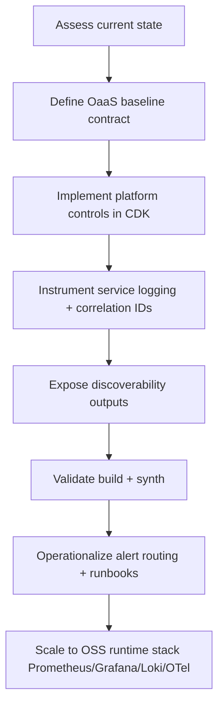

# OaaS Implementation Flow (Observability as a Service)

_Last updated: 2026-04-01_

## Why this flow exists

This document clarifies the practical implementation flow used in this repository to deliver Observability as a Service (OaaS) as a platform capability.

It is intended for:
- platform engineers implementing shared observability controls,
- application teams consuming the paved road,
- consulting stakeholders reviewing delivery maturity and implementation evidence.

## End-to-end implementation flow

## Step-by-step breakdown

### 1) Assess current state

- Confirm what telemetry already exists (API/Lambda logs, tracing, encryption).
- Identify operational gaps: missing dashboards, missing default alarms, and weak log correlation patterns.

**Output:** clear gap list and baseline scope.

## 2) Define OaaS baseline contract

Define what every service should get by default:
- shared alerting channel,
- baseline alarms for failures/latency,
- standard dashboard views,
- structured logging + correlation IDs,
- exported observability resource references.

**Output:** platform-managed observability contract.

## 3) Implement platform controls in CDK

Provision shared controls in infrastructure code:
- SNS alarm topic for centralized fan-out.
- CloudWatch alarms for core API/Lambda health indicators.
- CloudWatch dashboard widgets for key operational views.

**Output:** deployable observability control plane primitives.

## 4) Instrument service logging and request correlation

At the service handler level:
- emit structured JSON logs (`timestamp`, `level`, `service`, `message`, context fields),
- propagate `x-correlation-id` from inbound request to outbound response,
- guarantee correlation ID availability in both success and error paths.

**Output:** logs and traces that can be stitched during incident response.

## 5) Expose discoverability outputs

Export runtime identifiers to make observability assets easy to consume by tools and docs:
- dashboard name,
- alarm topic ARN,
- log group name.

**Output:** runbooks/portals can link to observability assets programmatically.

## 6) Validate and operationalize

- Validate build and CDK synthesis.
- Attach real notification endpoints (Slack/Email/PagerDuty) to alarm topic.
- Document routing and escalation policies.

**Output:** alerts become actionable in real operations.

## 7) Scale to open-source target stack

Progress from baseline to full open-source observability stack:
- Prometheus (metrics),
- Grafana (dashboards),
- Loki (logs),
- OpenTelemetry Collector + Tempo/Jaeger (traces).

**Output:** environment-wide, vendor-neutral observability platform.

## Ownership model

- **Platform team owns:** baseline architecture, alarms, shared dashboards, alert routing, policy and defaults.
- **Application teams own:** service SLOs, runbooks, business metrics, and on-call response for service-level incidents.

## Definition of done for OaaS flow

- [ ] Shared alarms deployed and routed to owned notification channels.  
  _Status:_ Alarms and SNS topic are implemented; endpoint subscriptions/routing ownership still pending.
- [x] Shared dashboard published and referenced in platform docs/runbooks.  
  _Status:_ Dashboard is implemented and referenced through platform documentation/output exports.
- [x] Correlation ID visible in both success and error API responses.  
  _Status:_ `x-correlation-id` is returned in both 200 and 500 responses in the Lambda handler.
- [ ] Structured logs adopted in default service template.  
  _Status:_ Structured logs are implemented in the sample Lambda, but template-level adoption is still pending.
- [ ] OSS observability stack rollout plan mapped for dev/stage/prod.  
  _Status:_ Target stack and phased direction are documented; environment-specific implementation mapping remains pending.
