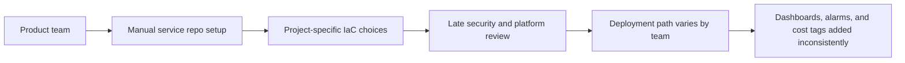
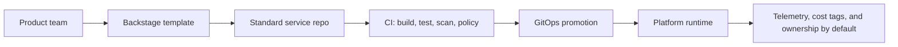

# Platform Engineering Consulting Case Study

_Last updated: 2026-07-01_

## Engagement summary

A product engineering organization wants to move from manually assembled service infrastructure to a secure, self-service internal developer platform. The engagement uses this repository as a working blueprint: assess the current state, define the platform product model, implement practical foundations, and establish adoption metrics.

## Client context

| Dimension | Starting Point | Business Impact |
|---|---|---|
| Service onboarding | New services require manual repo setup, IaC decisions, and security review. | Teams lose delivery time before writing product code. |
| Infrastructure patterns | CDK, Terraform, and Kubernetes examples exist, but patterns are not consistently packaged. | Duplicate implementation effort and uneven reliability. |
| Delivery controls | CI security scanning and policy checks are inconsistent across service paths. | Compliance risk appears late in the delivery cycle. |
| Observability | Dashboards and alarms are created per workload. | Incident detection depends on team maturity. |
| Operating model | Platform ownership is technical, but not yet managed as a product. | Stakeholders lack a shared roadmap and maturity view. |

## Consulting hypothesis

The client does not need a large platform rewrite first. The first valuable increment is a thin, well-documented platform product slice:

- A golden-path service template.
- A reusable CDK construct for common service infrastructure.
- A minimal Terraform example for Vault-backed secrets ownership.
- GitOps-ready manifests with policy checks in CI.
- Default telemetry, cost controls, and ownership metadata.
- A maturity scorecard that turns technical work into executive-readable outcomes.

## Current state diagram

## Target state diagram

## Delivery approach

| Phase | Consulting Activity | Practical Repository Asset | Outcome |
|---|---|---|---|
| 1. Assess | Review repo structure, delivery flow, guardrails, and observability. | `docs/platform-product-repository-review-2026-04-08.md` | Shared baseline and prioritized risks. |
| 2. Design | Define platform capabilities, ownership, and target architecture. | `docs/platform-product-architecture.md`, `docs/platform-product-operating-model.md` | Clear platform product contract. |
| 3. Implement | Add secure CDK defaults, GitOps checks, templates, and Terraform Vault example. | `packages/platform-constructs/`, `.github/workflows/`, `backstage/`, `terraform/` | Practical, demonstrable foundation. |
| 4. Enable | Document first-service onboarding and operating rituals. | `docs/onboarding/first-service.md`, `CONTRIBUTING.md` | Teams can adopt without platform engineers doing every handoff. |
| 5. Measure | Track maturity, KPIs, and next engagement increments. | `docs/platform-maturity-scorecard.md`, `docs/platform-product-progress.md` | Leadership can fund work by outcome, not tool preference. |

## Feature-to-outcome traceability

| Feature | Consulting Outcome | Success Signal |
|---|---|---|
| Backstage recommended-path template | Faster service onboarding | New service can be scaffolded and cataloged in under 30 minutes. |
| CDK API/Lambda/DynamoDB construct | Reduced infrastructure variation | Teams consume a versioned pattern instead of copying stack code. |
| Terraform Vault sample | Practical secrets governance | CI and service identities can be mapped to scoped secret access. |
| GitOps manifests and validation | Safer deployment promotion | Manifest errors and policy violations fail before merge. |
| OPA/Conftest deployment policy | Earlier compliance feedback | Insecure runtime settings are caught in pull requests. |
| Observability baseline | Faster incident detection | Services emit baseline logs, traces, alarms, and dashboards from day one. |
| FinOps tagging and budgets | Cost accountability | Spend can be attributed to owner, project, and environment. |

## Recommended next client increment

1. Stand up a minimal EKS runtime module and deploy one sample service through GitOps.
2. Promote policy checks from deployment-only controls to ingress, network, and availability controls.
3. Connect Backstage template execution to repository creation and catalog registration.
4. Add service-level SLO and runbook artifacts to the generated template.
5. Re-score maturity after one onboarded team and one production-like workload.

## Expected outcomes

- Lead time to first deployment moves toward the target of less than 30 minutes.
- Platform ownership becomes explicit across product, platform, security, and application teams.
- Security checks become part of the normal developer workflow.
- Reliability and cost visibility are included in the default service contract.
- Roadmap discussions are tied to adoption, compliance, reliability, and developer productivity metrics.
